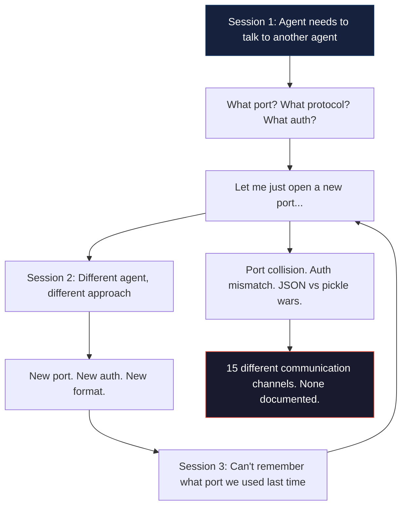
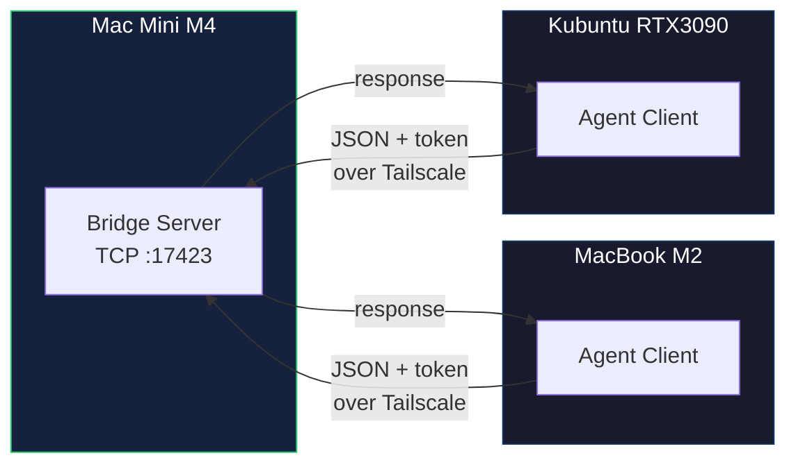
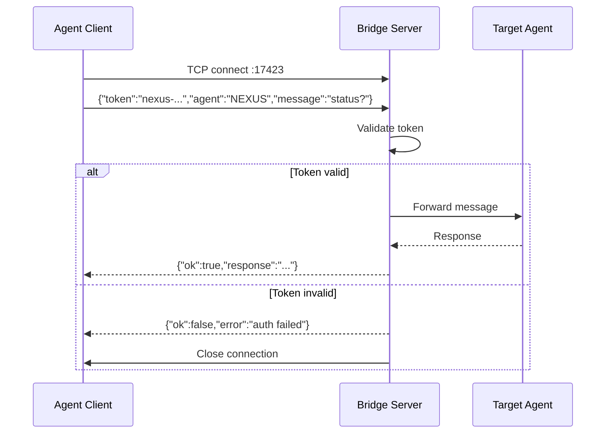

# TCP Bridge Agent Protocol

[](https://opensource.org/licenses/MIT)
[](https://python.org)

**One standard for AI agents to talk to each other across machines. JSON over TCP. Token auth. Zero dependencies beyond Python stdlib.**

---

> Every multi-agent project reinvents inter-agent communication. New ports. New protocols. New auth schemes. Every. Single. Time. TCP Bridge Agent Protocol says: one port, one token, one JSON format. Agents on macOS, Linux, in Docker, behind NAT — all speak the same language.

---

## The problem



Multi-agent systems have a communication chaos problem. Every agent, every session, every developer reinvents how agents talk to each other. Different ports, different serialization formats, different auth — none of it documented, none of it reusable. The TCP Bridge Protocol fixes this with a single standard: one port (17423), one token, one JSON format.

---

## What TCP Bridge Agent Protocol does

1. **Standardizes agent-to-agent communication** — every agent speaks the same protocol regardless of OS, language, or machine
2. **JSON over TCP with token auth** — no dependency on message brokers, no gRPC, no custom serialization. Just Python stdlib
3. **Works across machines** — macOS to Linux, Docker to bare metal, behind Tailscale or on LAN
4. **5-minute setup** — start the server on one machine, connect from any other



---

## Why not just [alternative communication method]?

| Alternative | Problem | Why it fails |
|-------------|---------|-------------|
| NATS | Requires a running NATS server. Adds infrastructure dependency | NATS is excellent but it's a message broker — another service to manage. The bridge is peer-to-peer TCP |
| HTTP REST API | Request/response only. No persistent connections for streaming | Every message is a new TCP handshake. Adds latency. No server push |
| gRPC | Requires protobuf compilation, code generation, language-specific tooling | Overkill for agent text messages. Adds build complexity |
| Writing to shared files | No real-time delivery. File locking hell with concurrent writes | Agent A writes. Agent B reads. Agent C overwrites. Race conditions everywhere |
| Redis pub/sub | Another service to run. Another dependency | Same as NATS argument. Great tool, wrong layer — bridge is infrastructure-light |

---

## Quick start

```bash
git clone https://github.com/nerudek/tcp-bridge-agent-protocol
cd tcp-bridge-agent-protocol

# Start the bridge server (default: port 17423)
python3 bridge_server.py &

# From another machine or terminal:
python3 bridge_client.py --host 192.168.1.100 --token "your-shared-token" --message "status?"
```

**60-second test (same machine):**
```bash
# Terminal 1: start server
python3 bridge_server.py --token test123 &

# Terminal 2: send a message
python3 bridge_client.py --token test123 --message '{"agent":"test","action":"ping"}'
# Response: {"ok":true,"response":"pong from bridge server"}
```

---

## Protocol specification

```
CONNECTION: TCP, port 17423 (configurable)
AUTH: Plain-text token in first message (TLS recommended for production)
FORMAT: JSON, one message per line (\n delimited)
ENCODING: UTF-8

Client sends:
{"token":"<shared-secret>","agent":"<agent-name>","message":"<payload>"}

Server responds:
{"ok":true,"response":"<reply>"}
or
{"ok":false,"error":"<error-message>"}
```

---

## How it works



### Deduplication

Messages with identical payload hashes arriving within a cooldown window (default: 5 minutes) are silently dropped. This prevents the exact type of onboarding loop that burned 400M tokens in the [postmortem incident](https://github.com/nerudek/hermes-token-loop-postmortem).

---

## Agent compatibility

The protocol is language-agnostic. Any language with TCP sockets and JSON can implement it.

| Language | Client implementation | Status |
|----------|----------------------|--------|
| Python | `bridge_client.py` (stdlib only) | ✅ Production |
| Bash | `echo '{"token":"..."}' | nc host 17423` | ✅ Works |
| Node.js | ~15 lines with `net` module | ✅ Trivial |
| Go | ~20 lines with `net` package | ✅ Trivial |

---

## Stats and context

- **Port: 17423** — single, documented, never changes
- **Dependencies: 0** beyond Python stdlib
- **Latency: <3ms** on localhost, <15ms over Tailscale LAN
- **Lines of code: ~80** for the server, ~40 for the client
- **Prevents token-burn loops** when combined with deduplication

---

## Installation

```bash
git clone https://github.com/nerudek/tcp-bridge-agent-protocol
cd tcp-bridge-agent-protocol

# No pip install needed. Stdlib only.
python3 bridge_server.py --token "your-shared-secret" &
```

**Requirements:**
- Python 3.6+ (anything with `socket` and `json` modules)
- Open TCP port between machines (LAN, Tailscale, or any VPN)
- A shared token (any string)

---

## Repository structure

```
tcp-bridge-agent-protocol/
├── bridge_server.py        # TCP server with token auth + dedup
├── bridge_client.py        # Client for sending messages
├── README.md               # THIS FILE — protocol spec + quick start
└── SKILL.md                # Agent skill reference
```

---

## Known problems

| Problem | Status | Workaround |
|---------|--------|------------|
| Plain-text token over TCP — not encrypted | Mitigated | Use over Tailscale (WireGuard encryption) or TLS wrapper. Token auth alone is not secure on untrusted networks |
| Single-threaded server — one connection at a time | Open | Use `socketserver.ThreadingTCPServer` for multi-agent setups. PRs welcome |
| No message persistence — if server crashes, messages lost | By design | For persistence, use NATS JetStream. This protocol is for real-time comms, not message queues |
| No built-in retry — client must implement reconnect logic | Open | Wrap client in a retry loop. Example in `bridge_client.py` |

---

## Contributing

- **Language ports:** Go, Rust, TypeScript implementations welcome
- **Multi-connection server:** PR for threaded server variant
- **Security:** TLS wrapper, mTLS support
- **Tests:** Currently manual. Automated test suite welcome

---

## License

MIT — see [LICENSE](LICENSE).

---

*Built by [nerudek](https://github.com/nerudek)*

☕ **Support:** [PayPal.me/nerudek](https://www.paypal.me/nerudek) | [Dev.to](https://dev.to/nerudek)
